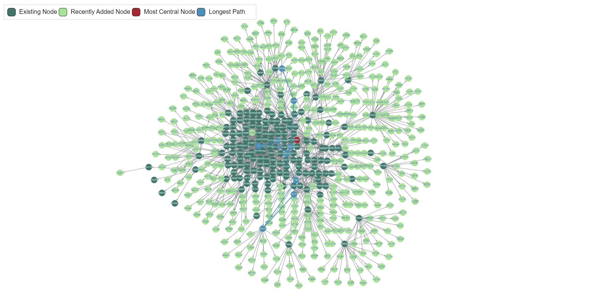
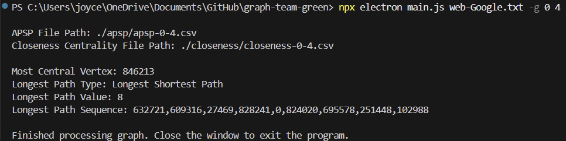
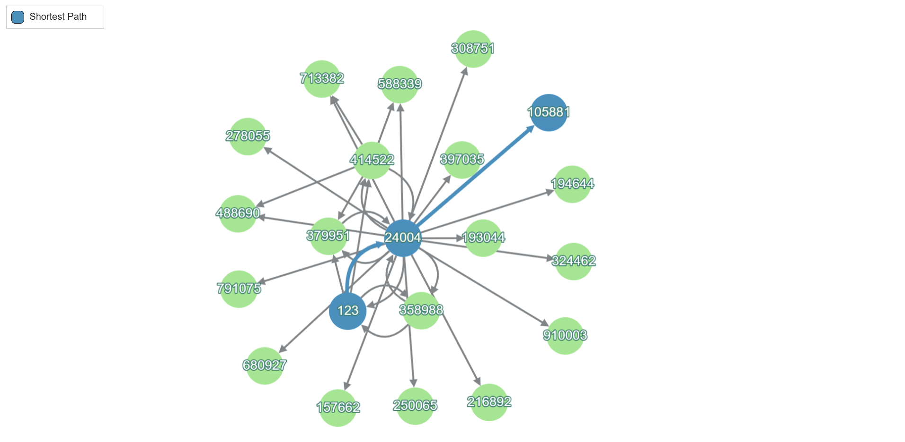
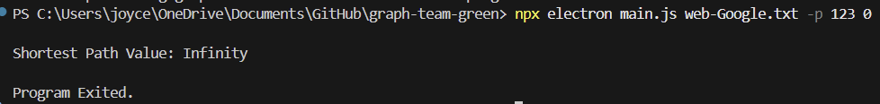

# Big Data Graph Analysis

## Introduction  
**Big Data Graph Analysis** is a program for processing and visualizing large-scale graphs using third-party libraries. It extracts subgraphs from datasets, computes **all-pairs shortest paths (APSP)**, and determines **closeness centrality** to highlight the **most central node** and the **longest path** (if computationally feasible). Additionally, it can find the **shortest path between two nodes** in the graph.  

The program utilizes data from the [Google Web Graph Dataset](https://www.kaggle.com/datasets/pappukrjha/google-web-graph/code) and supports:  

- **Subgraph Visualization** (`-g`) – Displays a subgraph of a specified depth.  
- **Centrality Analysis** – Identifies the most central vertex.  
- **Path Computation** (`-p`) – Finds the longest path within the subgraph and the shortest path between two nodes.  

### Purpose  
This project promotes technical and personal growth by enhancing familiarity with third-party libraries, applying graph theory to real-world challenges, and improving problem-solving skills.  

## Description

### **-g Flag:**
    
- **General Description:** Loads a subgraph from the specified dataset into memory using [graphlib](https://github.com/dagrejs/graphlib). The subgraph starts a single vertex and generates outward until the specified depth is reached. Once the graph is loaded, CSV files are created for all-pairs shortest paths and closeness centrality. Using the data collected from calculating closeness centrality, the most central node of the graph is highlighted. Finally, the longest path within the graph is highlighted. If it is too expensive to calculate the longest path, the longest of the shortest paths is highlighted instead.

- **Loading the Graph:** To prevent loading the entire graph into memory, edges and vertices are incrementally added layer by layer, similar to a breadth-first search. This means that the dataset is read once for each layer that is generated. 

> Called for each layer of depth.
  ```javascript
  // Called for each line of the dataset. currVertices is the set of vertices being processed.
  readStream.on("line", (currLine) => {

  // Skip lines that start with hashtag.
  if (!currLine.startsWith("#")) {
                
        // Get the two numbers on the line.
        let [numOne, numTwo] = currLine.split("\t");

        // Check if the edge belongs to the vertices being processed.
        if (currVertices.has(numOne)) {
                    
            webGraph.setEdge(numOne, numTwo);
        }
    }
});
  ```

- **All-Pairs Shortest Paths:** Calculated using a function from [graphlib](https://github.com/dagrejs/graphlib). The data is stored in a CSV file within a relative directory and sorted by identifier.
 
- **Closeness Centrality:** Closeness centrality is defined as the reciprocal of the sum of the shortest paths from one vertex to every other vertex. However, since the dataset used for this project contains directed edges, some vertices are unable to reach others. As a result, our project calculates the closeness centrality of each vertex with respect to the vertices it can actually reach, ignoring unreachable ones.

  $$
  C(v) = \frac{1}{\sum d(v, u)}
  $$
    
  One issue with the above approach is that ignoring many unreachable vertices can result in misleadingly high centrality values. For example, consider a vertex with a single outgoing edge that points to a vertex with only incoming edges. Since that vertex has only one reachable vertex and the shortest path is one, its centrality measure is one, despite the vertex not being integral to the overall structure of the graph. To avoid this, vertices with unreachables are not reported as the most central vertex.

> For each vertex, the below code runs for all other vertices. If the vertex has unreachables, it is marked as an invalid candidate.
```javascript
// For all other vertices in the graph, get the shortest distance.
let currShortest = Number(currLine.substring(currLine.lastIndexOf(",") + 1));

// Do not count the vertex as the most central node if it has unreachables.
// Centrality value is still calculated.
if (currShortest === "Infinity") {

    // Mark vertex as an invalid candidate for most central vertex.
    countVertex = false;
    return;
}

//Accumulate the shortest path values.
currCentrality += currShortest;
```

> For each vertex, the reciprocal of the sum of the shortest paths is taken and written to output.
```javascript
// Get the centrality measure.
if (currCentrality !== 0) {

    currCentrality = 1 / currCentrality;
}
```

- **Longest Path:** A solution for finding the longest path in a graph can be defined recursively. However, for large datasets, calculating the longest path is too computationally expensive. In order to determine when it is efficient to find the actual longest path, the longest path algorithm below was tested on various complete graphs. It was found that the longest path could be generated quickly for a complete graph with ten nodes, but not for a complete graph with eleven nodes. As a result, the program only calculates the actual longest path when there are less than ninety edges (the number of edges in a complete graph with ten nodes). In all other cases, the longest of the shortest paths is calculated instead using Dijkstra's algorithm.

> Recursive implementation of longest path function. It generates the longest path from a single vertex, so all vertices in the graph must processed by this function.
```javascript
function GenerateLongestPath(webGraph, vertexID, vertexStack) {
    
    if (webGraph.outEdges(vertexID)) {
        
        // For each outgoing edge find the length of the path and keep the longest one.
        let longestPathFound = 0
        let longestPathArr = Array.from(vertexStack);
        webGraph.outEdges(vertexID).forEach((edge) => {

            // Check that the vertex has not yet been visited.
            let nextVertex = edge.w;
            if (!ArrayHas(vertexStack, nextVertex)) {

                vertexStack.push(nextVertex);
                let currPathArr = GenerateLongestPath(webGraph, nextVertex, vertexStack);
                vertexStack.pop(nextVertex);

                // If a longer path has been found, save it.
                if (currPathArr.length > longestPathFound) {

                    longestPathFound = currPathArr.length;
                    longestPathArr = currPathArr;
                }
            }
        });

        // If all outgoing edges have been visited, return an array created from the vertex stack.
        return longestPathArr;
    } else {

        // If there are no outgoing edges, return an array created from the vertex stack.
        return Array.from(vertexStack);
    }
}
```

### **-p Flag:**

- **General Description:** The program loads a subgraph from the provided dataset, starting with the first vertex specified by the user. The subgraph is generated layer by layer until the destination vertex is detected. Then, Dijkstra's algorithm is used to generate the shortest path between the two nodes. If there are a small number of vertices, the shortest path is diaplayed, otherwise it is output to the console.

- **Dijkstra's Algorithm:** Calculated using a function from [graphlib](https://github.com/dagrejs/graphlib).

> Code used to recreate the shortest path from the output of Dijkstra's algorithm.
```javascript
function GenerateShortestPath(webGraph, sourceNode, destNode) {

    // Run Dijksrta to find all shortest paths from the source vertex.
    let shortestPaths = graphAlgorithms.dijkstra(webGraph, sourceNode);

    // Starting at the destination vertex, follow predecessors until the source is reached.
    let retPath = [destNode];
    while (retPath[retPath.length - 1] != sourceNode) {

        retPath.push(shortestPaths[retPath[retPath.length - 1]].predecessor);
    }

    // Since the destination is at the start of the array, reverse it.
    return retPath.reverse();
}
```

## Requirements
To run this program, ensure your system meets the following requirements:

### Hardware Requirements
- Minimum **8GB RAM** (recommended for handling large graphs).
- **Multi-core processor** for efficient computation.
- **At least 500MB of available disk space** (for storing graph data and results).

### Software Requirements
- **Operating System:**  
  - Windows 10/11, macOS, or Linux.
- **Node.js & npm:**  
  - Install the latest **LTS version** of Node.js ([Download Node.js](https://nodejs.org/)).  
  - Verify installation by running:  
    ```sh
    node -v
    npm -v
    ```
- **Electron:**  
  - Required for GUI visualization. Installed automatically via dependencies.
- **Required Dependencies:**  
  The following Node.js packages will be installed automatically:
  - [`electron`](https://www.electronjs.org/)
  - [`graphlib`](https://github.com/dagrejs/graphlib)
  - [`cytoscape`](https://js.cytoscape.org/)
  - [`open`](https://www.npmjs.com/package/open)
  - [`ws`](https://www.npmjs.com/package/ws)


## User Manual
Follow these steps to set up and run the program.

### 1. Install Dependencies
1. **Clone the repository** (or download the source code):
   ```sh
   git clone https://github.com/csc3430-winter2025/graph-team-green.git
   cd graph-team-green
   ```
2. **Install dependencies using npm:**
   ```sh
   npm install
   ```

### 2. Running the Program
The program supports **two modes**:  
1. **Graph Mode (`-g`)** - Generates and visualizes a subgraph.  
2. **Shortest Path Mode (`-p`)** - Finds the shortest path between two nodes.

#### Graph Mode (`-g`):
Creates and displays a subgraph starting from a specified node.  

**Usage:**  
```sh
npx electron main.js <file-path> -g <start-node> <depth>
```
**Example:**
```sh
npx electron main.js web-Google.txt -g 123 3
```
- **`data.txt`**: Graph dataset file.
- **`123`**: Starting node.
- **`3`**: Depth of the subgraph.
- The program will **visualize the subgraph** and output:
  - APSP results in a CSV file.
  - Closeness centrality calculation.
  - Most central node.
  - Longest path (or longest shortest path if computation is expensive).

#### Shortest Path Mode (`-p`):
Finds the shortest path between two nodes by generating a subgraph which contains them.

**Usage:**  
```sh
npx electron main.js <file-path> -p <start-node> <end-node>
```
**Example:**
```sh
npx electron main.js web-Google.txt -p 123 105881
```
- **`123`**: Start node.
- **`105881`**: Destination node.
- The program will:
  - Compute the shortest path.
  - Output the **shortest path value** and **sequence of nodes**.
  - If the graph is **small (<100 nodes)**, the visualization window will open.
  - If **too large**, results will be displayed in the console.

### 3. Output Files
- `apsp/apsp-<start>-<depth>.csv` → **All-Pairs Shortest Paths Data**
- `closeness/closeness-<start>-<depth>.csv` → **Closeness Centrality Data**

### 4. Exiting the Program
- Close the Electron window to **exit**.
- If running in console mode, the program will exit automatically.

## Reflection

### **Youtube Video Link**
[](https://youtu.be/CCIK5NKDzPU)

### **Time Complexity Analysis**
- **All-Pairs Shortest Paths (APSP):** Uses **Floyd-Warshall Algorithm** → **O(n³)**.
- **Dijkstra’s Algorithm:** Used for shortest path calculations → **O((V + E) log V)**.
- **Closeness Centrality Calculation:** Iterates over APSP results → **O(n²)**.

Efficient graph processing is crucial when dealing with large datasets. The **time complexity** of key algorithms used in this project is analyzed below:

1. **All-Pairs Shortest Paths (APSP):**  
   - The Floyd-Warshall algorithm is used for computing shortest paths between all node pairs.
   - It has a time complexity of **O(n³)** due to its triple nested loops iterating over all nodes.
   - While effective for small graphs, it can become computationally expensive for large graphs.
  
2. **Dijkstra’s Algorithm:**  
   - Used for single-source shortest path calculations.
   - Implemented with a priority queue (Min-Heap), resulting in a time complexity of **O((V + E) log V)**.
   - More efficient than Floyd-Warshall for sparse graphs where not all nodes are connected.
  
3. **Closeness Centrality Calculation:**  
   - Requires summing up the shortest path distances for every node.
   - Since APSP results are precomputed, this step involves **O(n²)** operations, iterating over the shortest path matrix.
  
4. **Finding the Longest Path:**
   - Involves checking every outgoing edge for each vertex.
   - The recursive function implemented could potentially branch out into **n** different paths for each node, making its time complexity **O(n!)**.

The combination of these approaches ensures the program can handle large graphs while maintaining computational efficiency.

### **Challenges and Solutions**

### **1. Handling Large Graphs (~75MB Dataset)**

#### **Issue:**  
Processing a **75MB dataset** containing **millions of edges** posed a significant challenge. Loading the entire dataset into memory at once was infeasible due to memory constraints.  

#### **Solution:**  
- Implemented an **incremental graph-building approach** similar to **Breadth-First Search (BFS)**.  
- Instead of loading the entire graph at once, the program **constructs the graph layer by layer**, adding nodes dynamically.  
- This reduces memory overhead while still allowing the exploration of graph structures efficiently.  
- Only the necessary portion of the graph (defined by depth) is loaded, preventing excessive memory consumption.

### **2. Closeness Centrality Without Library Support**

#### **Issue:**  
The project required **manual computation** of **closeness centrality**, meaning we could **not** use built-in functions from libraries like **Graphlib**.  

#### **Solution:**  
- Implemented a **custom APSP file parser** to extract shortest path data efficiently.  
- Instead of recalculating paths dynamically, **precomputed APSP results were stored in CSV files** and later parsed for centrality computation.  
- Used **stream processing** to read large files in chunks, avoiding memory overflows.  
- Optimized centrality calculations using **hash maps** for fast lookups of shortest path values.

This approach significantly improved **runtime efficiency** and ensured correctness without relying on third-party closeness centrality functions.

### **3. Graph Visualization Performance**

#### **Issue:**  
- Large-scale graphs caused **lag and performance drops** when rendered using **Cytoscape.js**.  
- As the number of nodes increased, the visualization became cluttered, making it difficult to analyze the graph efficiently.  

#### **Solution:**  
- Implemented **layered animations** to load subgraphs **dynamically** instead of rendering everything at once.  
- Used **progressive rendering**, where the visualization updates in steps rather than loading thousands of nodes instantly.  
- Applied **color-coded nodes** to improve visibility and highlight important elements like the **most central node** and **longest path**.  
- Restricted unnecessary re-renders by caching previously loaded nodes.  

These improvements ensured a **smooth user experience**, even when visualizing large graphs.

### **Team Peer Review**
- Joyce Tang 10 points
- Fletcher Green 10 points

## **Results**

### **Graph Mode (`-g`) Example**

#### Command:

```sh
npx electron main.js web-Google.txt -g 0 4
```

#### Graph Visualization:


#### Terminal Output:


### **Shortest Path Mode (`-p`) Examples**

#### Command:

```sh
npx electron main.js web-Google.txt -p 123 105881
```

#### Output:


#### Command:

```sh
npx electron main.js web-Google.txt -p 123 0
```

#### Output:




